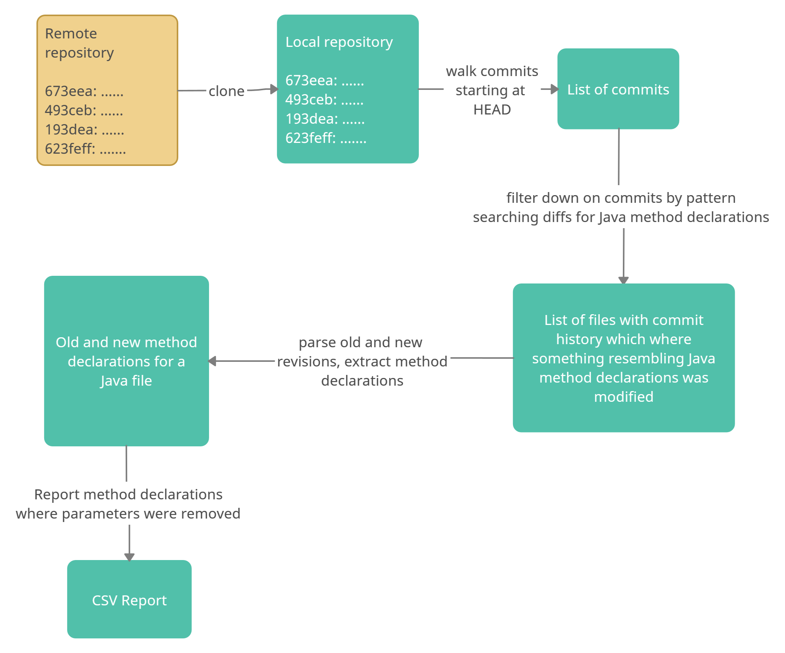

# commit-analyser
This program analyses a code repository and generates a report that lists all commits that removed method parameters.

## Sample Reports:

Please find sample reports in `/reports` directory generated for some popular Java repositories:
* [redisson](https://github.com/redisson/redisson.git) : ~6000 commits on default branch, 2m40s to generate report on my local machine
* [retrofit](https://github.com/square/retrofit.git) : ~2000 commits on default branch, 46s to generate report on my local machine
* [spring-boot](https://github.com/spring-projects/spring-boot.git) ~30000 commits on default branch, 7m40s to generate report on my local machine

_Note: times mentioned include time taken to clone the repository_

## Running the program:

#### Prerequisite for the running the program:
* Java 8

To run, please clone the project and run the following from the command-line:

```./gradlew run --args='[https-remote-git-url] [output-path]'```

```
[https-remote-git-url]   =    a valid HTTPS remote Git URL to a public repository
[output-path]            =    a valid path on local filesystem where the program has RW access
```

_Note: both arguments are required and in the exact order. Changing the order would result in undefined behaviour._

Sample output:

```Mandar@Mandar-PC MINGW64 ~/Desktop/commit-analyser (main)
$ ./gradlew run --args='https://github.com/apache/dubbo-samples.git out'

> Task :run
2020-12-27 12:11:18:965 +0530 [main] INFO GitClient - Cloning remote repository present at https://github.com/apache/dubbo-samples.git at local path 'out\remote'
2020-12-27 12:11:18:965 +0530 [main] WARN GitClient - Directory out\remote exists. Contents of this directory would be recursively deleted.
2020-12-27 12:11:33:826 +0530 [main] INFO GitClient - Repository cloned
2020-12-27 12:11:33:826 +0530 [main] INFO GitClient - Obtaining commits modifying lines resembling Java method declarations
2020-12-27 12:11:35:394 +0530 [main] INFO GitClient - Found 259 such commits
2020-12-27 12:11:35:394 +0530 [main] INFO Application - Iterating over commits, parsing files if required and generating report..
2020-12-27 12:11:37:340 +0530 [main] INFO Application - Found 5 commits where method parameters were removed
2020-12-27 12:11:37:341 +0530 [main] INFO ReportWriter - Writing report
2020-12-27 12:11:37:511 +0530 [main] INFO Application - Wrote report to report_dubbo-samples_20201227121137.csv

BUILD SUCCESSFUL in 22s
4 actionable tasks: 3 executed, 1 up-to-date

```
## Flow

A flowchart describing high-level flow of the program:



## Core logic

The core logic to identify whether a parameter was removed is as follows:

1. Obtain function signatures from old and new revisions of a Java file as a list.
   
  e.g.  Consider a Java file with following method declarations:
   
         int subtract(int a, int b, long c)
         
         List<Integer> concatenate(List<Integer> list1, List<Integer> list2)
         
         void methodA()
         
         void methodC()
         
         void methodD(ClassA a, int count)
 
  which were changed to
  
         int subtract(int a, long c)
         
         List<Integer> concatenate(List<Integer> list1, List<Integer> list2, List<Integer> list3)
         
         void methodB()       //methodA refactored to methodB
         
         void methodC()
         
         void methodD(ClassA a, long count)
   
   Here, old and new method declarations are obtained as follows:
   
      oldMethodDeclarations: [
      {"methodName":"subtract", "paramList":["int", "int", "long"]},
      {"methodName":"concatenate", "paramList":["List<Integer>", "List<Integer>"]},
      {"methodName":"methodA", "paramList":[]},
      {"methodName":"methodC", "paramList":[]},
      {"methodName":"methodD", "paramList":["ClassA", "int"]}
      ]

      newMethodDeclarations: [
      {"methodName":"subtract", "paramList":["int", "long"]},
      {"methodName":"concatenate", "paramList":["List<Integer>", "List<Integer>", "List<Integer>"]},
      {"methodName":"methodB", "paramList":[]},
      {"methodName":"methodC", "paramList":[]},
      {"methodName":"methodD", "paramList":["ClassA", "long"]},
      ]
        
   _Note: local parameter variables are not considered as they do not change function signatures_
   
2. Compare new and old method declarations, and:
   * Remove newly added or deleted methods
   * Remove methods that did not change
   
   After this operation, the above lists are reduced to:
   
       oldMethodDeclarations: [
       {"methodName":"subtract", "paramList":["int", "int", "long"]},
       {"methodName":"concatenate", "paramList":["List<Integer>", "List<Integer>"]},
       {"methodName":"methodD", "paramList":["ClassA", "int"]}
       ]

       newMethodDeclarations: [
       {"methodName":"subtract", "paramList":["int", "long"]},
       {"methodName":"concatenate", "paramList":["List<Integer>", "List<Integer>", "List<Integer>"]},
       {"methodName":"methodD", "paramList":["ClassA", "long"]},
       ]

3. Name-wise consider method declarations one-by-one from old list with corresponding match from new list, and check whether the parameters
   from the old method declaration are present in the parameter list of new method declaration. Order of the parameters does not matter.
   
   The implementation considers the parameter list as a multiset i.e. a set where elements may be duplicated. Multiset is
   implemented as a map of the element name to its count (Map<String, Integer>). The old parameter multiset is iterated upon,
   and each element's count is compared against count corresponding to the element in the new parameter multiset. If old count is lesser than
   newer count, the parameter is considered to be removed, and 'true' is returned.
   
   Continuing with our above example, we consider method declarations one-by-one:
   
   `{"methodName":"subtract", "paramList":["int", "int", "long"]}`
   
    vs
    
   `{"methodName":"subtract", "paramList":["int", "long"]}`
   
   As new method has one less `int` parameter than the old method, parameter is considered as removed. This instance is **added to the report**.
  
  
  
  
   `{"methodName":"concatenate", "paramList":["List<Integer>", "List<Integer>"]}`
   
     vs
     
    `{"methodName":"concatenate", "paramList":["List<Integer>", "List<Integer>", "List<Integer>"]}`
   
   As new method has all parameters from the old method, no parameter is considered to be removed. This instance is **not added to the report**.
   
   
   
   
   `{"methodName":"methodD", "paramList":["ClassA", "int"]}`
   
     vs
     
    `{"methodName":"methodD", "paramList":["ClassA", "long"]}`
   
   As new method does not have `int` parameter that was previously present in the old method, parameter is considered as removed. This instance
   is **added to the report**.
   
   _Note: When multiple overloaded methods are changed in the same commit, the code uses a best-effort approach to correctly match the changes._
         _However, it is possible to have adverserial inputs. In such a case, the current version of the core logic will not be able correctly_
         _match method changes for overloaded methods._
## Current assumptions:

* The program expects an HTTPS Git remote URL.
* This program analyses commits starting from where the HEAD points at (generally main or master branch) and walks these commits backwards. It would not be difficult to extend the same code to generate report for all branches.
